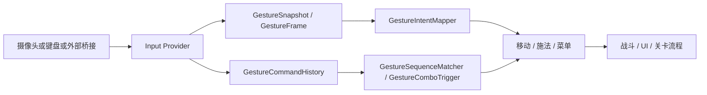

# 符印守卫：手势识别与项目框架入门说明

这份文档面向新手，目标是把这个项目里“技术都是什么、代码怎么连起来、手势是怎么识别成游戏动作的”讲清楚。

## 1. 这个项目在做什么

`Spell Guard / 符印守卫` 是一个 Unity 手势体感游戏原型。

玩家把手伸到摄像头前，系统先识别手势，再把手势翻译成游戏动作，例如：

- `Fist` -> 火焰术
- `V Sign` -> 冰霜术
- `Open Palm` -> 护盾术
- 左右/上下挥动 -> 菜单切换、移动、训练动作

整个项目不是“摄像头识别完直接控制游戏”，而是做了一个中间层，把原始识别结果整理成统一的命令，再交给战斗、移动、菜单去消费。

---

## 2. 项目技术栈

### 前端 / 展示层

- Unity 6 风格的 C# 游戏项目
- 场景、UI、角色、战斗、输入都在 Unity 内完成

### 手势识别层

- MediaPipe Hands：识别手部关键点
- UDP / 外部桥接：把外部程序识别结果传进 Unity
- Mock 模式：不用真摄像头，直接用键盘模拟，方便调试和演示

### 运行支撑

- `Python`：桥接脚本和离线测试脚本
- `ScriptableObject`：配置识别参数、关卡、法术等数据
- `Unity Test Runner`：编辑器测试和播放模式测试

---

## 3. 代码总架构

先记住一句话：

**摄像头/键盘/外部程序 -> 输入提供器 -> 手势命令 -> 意图映射 -> 战斗/移动/UI**

### 核心分层

1. **输入采集层**
   - `MockGestureInputProvider`
   - `NativeMediapipeGestureProvider`
   - `ExternalGestureBridgeProvider`

2. **识别层**
   - `NativeMotionGestureRecognizer`
   - `ExternalMotionGestureRecognizer`
   - `CustomGestureRecognizer`

3. **抽象层**
   - `GestureSnapshot`
   - `GestureFrame`
   - `GestureCommand`
   - `GestureAction`
   - `GestureIntent`

4. **映射层**
   - `GestureIntentMapper`
   - `GestureComboTrigger`
   - `GestureSequenceMatcher`

5. **游戏层**
   - `FpsGestureMotor`
   - `GestureSpellCaster`
   - `GameFlowManager`
   - `SpellGuardFlowController`

---

## 4. 最重要的三个概念

### 4.1 GestureSnapshot

它表示“当前这一瞬间，手势看起来是什么样”。

字段很简单：

- 有没有手 `HandPresent`
- 当前静态手势 `Gesture`
- 手在屏幕中的位置 `ViewportPosition`
- 置信度 `Confidence`

可以把它理解成“单帧结果”。

相关文件：

- `Assets/Scripts/Input/GestureSnapshot.cs`

### 4.2 GestureFrame

它比 `GestureSnapshot` 更完整，里面还会带：

- 这帧来自哪里 `Source`
- 当前有哪些手 `Hands`
- 最新的动态动作 `LatestMotion`

也就是说，`GestureFrame` 是“一个完整输入帧”。

相关文件：

- `Assets/Scripts/Input/GestureFrame.cs`
- `Assets/Scripts/Input/LegacyGestureRuntimeAdapter.cs`

### 4.3 GestureCommand / GestureAction / GestureIntent

这三个名字最容易混，按这个顺序理解就行：

- `GestureCommand`：识别层产出的“原始命令”
- `GestureAction`：进一步包装后的“可执行动作”
- `GestureIntent`：动作语义，比如“施法火球 / 向左移动 / 菜单确认”

例如：

- `GestureCommand` 可能表示“检测到一次 Snap”
- `GestureAction` 会把它包装成一个带时间、置信度、来源的动作
- `GestureIntent` 则把它翻译成 `CastFire` 或 `MenuConfirm`

相关文件：

- `Assets/Scripts/Input/GestureCommand.cs`
- `Assets/Scripts/Input/GestureAction.cs`
- `Assets/Scripts/Input/GestureIntent.cs`

---

## 5. 手势识别是怎么做出来的

这个项目的手势识别不是单一算法，而是“静态姿势 + 动态动作 + 连招组合”三层结构。

### 5.1 静态姿势

静态姿势是“这一瞬间手长什么样”。

项目里主要看：

- `Point`
- `Fist`
- `VSign`
- `OpenPalm`

这些姿势在很多地方会被直接映射成游戏含义：

- 战斗中：火、冰、盾
- 菜单中：确认、返回
- 移动中：后退或方向提示

关键代码：

- `NativeMediapipeGestureProvider.SetSnapshot(...)`
- `ExternalGestureBridgeProvider.PushSnapshot(...)`
- `GestureIntentMapper.MapSpellStatic(...)`
- `GestureIntentMapper.MapMenuStatic(...)`

### 5.2 动态动作

动态动作是“手在移动，或者手势从一个状态变成另一个状态”。

项目里已经定义了很多动态动作类型：

- 左右挥动
- 上下挥动
- OpenPalm 横向拍击
- Snap
- PointToFist
- BodyShiftLeft / Right

关键识别器：

- `NativeMotionGestureRecognizer`
- `ExternalMotionGestureRecognizer`

它们的做法是：

1. 收集最近一小段时间的手部采样
2. 判断位移、速度、方向
3. 满足阈值后输出一个 `MotionGestureEvent`

### 5.3 连招 / 组合

除了单次动作，项目还支持“动作序列”。

例如默认组合规则里：

- `Fist + Snap` -> 火焰术
- `OpenPalm + SwipeLeftToRight` -> 护盾术

这类逻辑由这些类处理：

- `GestureSequenceMatcher`
- `GestureComboTrigger`
- `GestureCommandHistory`

它们会记住最近一串命令，再判断“这串命令是不是某个固定模式”。

---

## 6. 三种输入模式

### 6.1 Mock

这是最适合新手和调试的模式。

特点：

- 不用摄像头
- 用键盘直接模拟手势
- 稳定，方便做演示和测试

对应文件：

- `Assets/Scripts/Input/MockGestureInputProvider.cs`

### 6.2 NativeMediapipe

这是 Unity 内部的目标运行路径。

特点：

- 直接使用摄像头
- 用 MediaPipe Hands 提取关键点
- 再交给 `NativeMotionGestureRecognizer` 做动态手势识别

对应文件：

- `Assets/Scripts/Input/NativeMediapipeGestureProvider.cs`
- `Assets/Scripts/Input/NativeMotionGestureRecognizer.cs`

### 6.3 ExternalBridge

这是外部桥接模式。

特点：

- 外部程序先做识别
- 通过 UDP 或帧数据送进 Unity
- Unity 只负责接收和消费结果

对应文件：

- `Assets/Scripts/Input/ExternalGestureBridgeProvider.cs`
- `Assets/Scripts/Input/ExternalMotionGestureRecognizer.cs`
- `Assets/Scripts/Input/UdpGestureReceiver.cs`

---

## 7. 手势到游戏动作的转换

这是整套系统最关键的地方。

### 7.1 输入提供器统一入口

`GestureInputRouter` 会根据当前模式选择不同来源：

- Mock
- NativeMediapipe
- ExternalBridge

它像一个总开关，把不同输入源统一成同一种对外接口。

相关文件：

- `Assets/Scripts/Input/GestureInputRouter.cs`

### 7.2 语义映射

`GestureIntentMapper` 负责把“识别结果”翻译成“游戏语义”。

比如：

- 菜单确认
- 向前移动
- 施放火球
- 训练动作

这一步很重要，因为游戏逻辑不应该直接依赖“Snap”或“Fist”这种底层识别名，它应该只关心“玩家想做什么”。

### 7.3 游戏消费

最终进入两个主要消费点：

- `FpsGestureMotor`：负责移动
- `GestureSpellCaster`：负责施法

它们只看 `GestureAction` 或 `GestureIntent`，不关心手势是怎么识别出来的。

---

## 8. 战斗系统怎么接手势

### 8.1 移动

`FpsGestureMotor` 会读取当前 `GestureFrame`，把动作转换成角色位移。

支持：

- 前进
- 后退
- 左移
- 右移

它有两个重要机制：

- **离散步进**：不是每帧都滑动，而是走一小步
- **冷却时间**：避免一次手势触发多次移动

### 8.2 施法

`GestureSpellCaster` 负责把手势变成法术。

基本流程：

1. 从输入里拿到动作
2. 映射成法术类型
3. 进行短暂确认
4. 满足确认时间后正式施法
5. 对敌人或护盾生效

支持的法术：

- 火焰术 `Fire`
- 冰霜术 `Ice`
- 护盾术 `Shield`

### 8.3 结算

战斗结束、胜利、失败由流程层处理：

- `GameFlowManager`
- `SpellGuardFlowController`

它们负责：

- 统计分数
- 判断胜负
- 切换场景
- 记录训练、结果、教程完成状态

---

## 9. 自定义手势系统

这部分是项目里比较进阶的内容。

### 9.1 它解决什么问题

默认手势只有火、冰、盾和几种移动，但项目还支持“玩家自己录一个新手势”。

### 9.2 相关结构

- `CustomGestureTemplate`：一个自定义手势模板
- `CustomGestureSample`：模板下的一次样本
- `CustomGestureFrameSample`：样本里的单帧数据
- `CustomGestureLibrary`：本地模板库
- `CustomGestureRecognizer`：识别器

### 9.3 识别思路

自定义手势分两类：

- `StaticPose`：静态姿势，靠关键点特征比较
- `DynamicMotion`：动态动作，靠轨迹匹配

#### 静态识别

`CustomGestureFeatureExtractor` 会把手部关键点转成特征向量。

做法大概是：

1. 取 21 个手部关键点
2. 以手腕为原点
3. 用手掌尺度归一化
4. 得到一组稳定特征
5. 和模板做距离比较

#### 动态识别

`CustomGestureTrajectoryMatcher` 会：

1. 从最近一段时间采样中提取轨迹
2. 归一化轨迹大小
3. 重采样到固定点数
4. 与模板轨迹做相似度评分

#### 模板管理

`CustomGestureLibrary` 会把模板保存成 JSON，放在项目目录里。

---

## 10. 外部桥接数据长什么样

如果外部程序给 Unity 传数据，会使用：

- `ExternalVisionFrame`
- `ExternalVisionPoint`

其中可能包括：

- `handPresent`
- `gesture`
- `x / y`
- `confidence`
- `handLandmarks`
- `poseLandmarks`

Unity 收到这些帧后，会再做一次标准化和识别。

---

## 11. 项目里最值得先看的文件

如果你是第一次读这套代码，建议按这个顺序看：

1. `Assets/Scripts/Input/GestureInputProviderBase.cs`
2. `Assets/Scripts/Input/GestureInputRouter.cs`
3. `Assets/Scripts/Input/GestureSnapshot.cs`
4. `Assets/Scripts/Input/GestureFrame.cs`
5. `Assets/Scripts/Input/GestureCommand.cs`
6. `Assets/Scripts/Input/GestureIntentMapper.cs`
7. `Assets/Scripts/Input/NativeMotionGestureRecognizer.cs`
8. `Assets/Scripts/Input/ExternalMotionGestureRecognizer.cs`
9. `Assets/Scripts/Player/FpsGestureMotor.cs`
10. `Assets/Scripts/Player/GestureSpellCaster.cs`
11. `Assets/Scripts/Core/SpellGuardFlowController.cs`

---

## 12. 新手怎么理解这套架构

你可以把它想成四层：

### 第一层：看见手

摄像头或键盘只负责“给数据”。

### 第二层：认识动作

识别器负责把原始数据变成“手势结果”。

### 第三层：理解意图

映射器负责把“手势”翻译成“玩家要做什么”。

### 第四层：执行游戏

战斗、移动、UI、关卡负责真正改游戏状态。

这样拆开的好处是：

- 好调试
- 好扩展
- 好换输入源
- 好做测试

---

## 13. 一句话总结

这个项目的本质不是“一个摄像头识别 demo”，而是一个**把视觉手势、动作语义、游戏逻辑拆开设计的 Unity 体感游戏框架**。

如果你先把 `Snapshot -> Frame -> Command -> Intent -> Gameplay` 这条链路看懂，再去看具体识别算法，就会顺很多。
