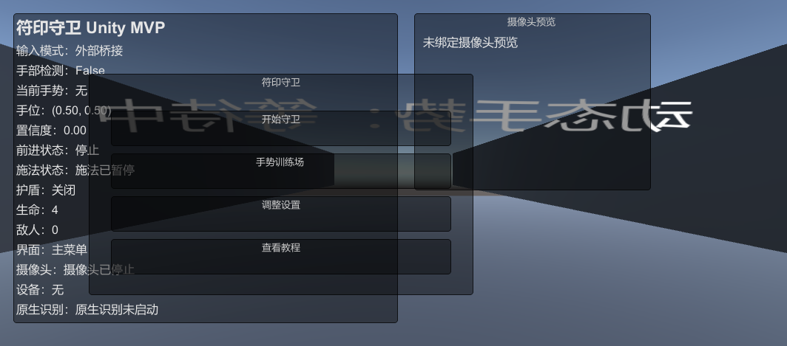

# Spell Guard Unity Prototype

Spell Guard is a graduation-project Unity combat prototype about gesture-driven spell casting. It combines a layered runtime, live HUD/debug feedback, and multiple input sources so the project can evolve from simple hand poses into richer gesture commands and combos.

## Why this project

The project is designed to show a complete vision-to-gameplay pipeline:

- YOLO + MediaPipe oriented gesture input
- real-time Unity combat interaction
- command-driven gesture runtime
- dataset validation and automated tests for self-checking

## Highlights

- First-person 3D combat loop with spell casting, enemy pressure, shield/HP, and menu flow
- Gesture input abstraction with Mock, native MediaPipe, and external bridge sources
- Command-driven runtime (`GestureFrame`, `GestureCommand`, command history, sequence matching)
- HUD + world-space gesture feedback for live debugging
- EditMode / PlayMode tests for runtime, sequence matching, and dataset validation
- Editor tool for generating the prototype scene

## Quick Start

1. Open `unity-spell-guard/` in Unity Hub
2. Wait for the project to import
3. Open `Assets/Scenes/SpellGuardPrototype.unity`
4. Press Play
5. Optional: run `Spell Guard/Create Prototype Scene` if you need to regenerate the prototype scene from editor tooling

The prototype scene is included in Build Settings as the first scene, so a standalone build can start from the demo loop directly.

## Runtime Modes

Press `F1` to switch input source:

- `Mock` – deterministic keyboard-driven testing and the default safe demo mode
- `NativeMediapipe` – the target in-Unity runtime path, started only when selected
- `ExternalBridge` – compatibility / replay path via UDP bridge

Native MediaPipe startup is guarded so camera or native initialization issues can fall back to the stable demo path instead of blocking the whole flow.

## Controls

### Mock mode

- `Tab` – toggle hand present
- `1` – Point
- `2` – Fist
- `3` – V Sign
- `4` – Open Palm
- `0` – clear gesture
- `I / J / K / L` – move virtual hand
- `Left Shift` – faster movement

### Gameplay mapping

- Point → camera guidance and forward step intent
- Open Palm → defensive step-back intent / shield semantics
- Left / Right motion gestures → lateral repositioning
- Fist → fire spell
- V Sign → ice spell
- Open Palm → shield spell
- Motion gestures are routed through the command layer to support movement, menu navigation, and future combos

## Gesture Runtime

The current runtime is organized as:

- frame ingestion (`GestureFrame`, `TrackedHandState`)
- feature extraction
- primitive gesture recognition
- sequence / combo resolution
- gameplay command consumption

This removes direct gameplay dependence on a single latest snapshot and makes it easier to expand toward:

- richer single-hand dynamics
- fast gesture groups and combos
- dual-hand composition

## Dataset Self-Test

The repository includes a training dataset folder at `E:\毕设\gesture-game\训练集`.

Unity now includes an editor-only validator:

- `Spell Guard → Validate Training Dataset`

It checks:

- `annotations*.zip`
- `videos*.zip`
- required annotation files (`metadata.csv`, `classIdx.txt`, `Annot_TrainList.txt`, `Annot_TestList.txt`, `Video_TrainList.txt`, `Video_TestList.txt`)
- `.tgz` archives inside the video package
- `.avi` clips inside each `.tgz`

## Tests

Available test coverage includes:

- runtime adapter tests for Mock / Native / External providers
- gesture sequence matcher tests
- native and external motion recognizer tests
- edit-mode training dataset validation tests

## Project Structure

- `Assets/Scripts/Input/` – gesture runtime, providers, command/history, sequence matching
- `Assets/Scripts/Player/` – player motion and spell casting
- `Assets/Scripts/UI/` – HUD and world-space feedback
- `Assets/Editor/` – editor tools, including prototype scene and dataset validation
- `Assets/Tests/` – EditMode / PlayMode tests
- `Docs/` – technical notes and refactor plan

## Current Status

The project is in a stable defense-demo stage:

- command-driven runtime is wired into gameplay
- menu → tutorial/training → combat → results → restart/menu loop is implemented
- Mock is the default safe startup mode; Native MediaPipe and ExternalBridge remain switchable
- build settings include `Assets/Scenes/SpellGuardPrototype.unity`
- tests are present for runtime, flow, scene generation, motion recognition, and dataset validation

The remaining work is mainly richer level content, final art polish, and presentation packaging.
